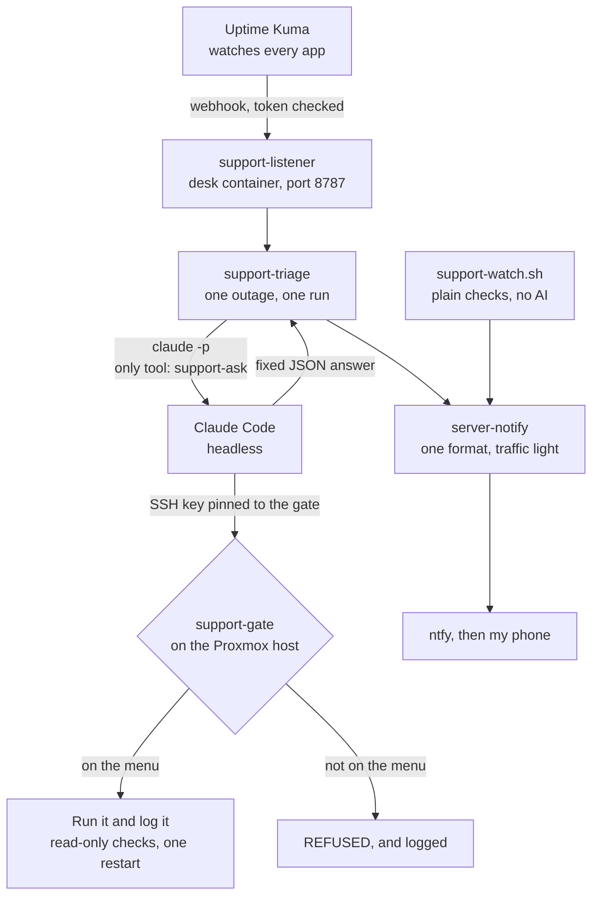

# Homelab support desk

Automated monitoring and incident response for a Proxmox home server. When something goes down, Claude investigates, applies an approved fix if there is one, and sends a single plain-English notification to my phone.


It's been running on my own server since 23/09/2026. On that day I stopped one of my apps (Forgejo, a self-hosted code store) on purpose. Uptime Kuma saw it go down at 22:26:44, Claude restarted it and checked it was back, and the notification went out at 22:27:59. That was about 75 seconds, with nobody touching a keyboard. That's one real test on one server, so treat it as experimental.

The part I'd actually defend in an interview is what the AI isn't allowed to do. Its permissions are limited by an SSH key, not by instructions in a prompt.

## What it does

- **First line: monitoring.** Uptime Kuma watches every app. Plain scripts watch the disks, the mounts and Kuma itself.
- **Second line: triage.** A fault wakes Claude Code in headless mode. It can run read-only checks (disk space, failed services, logs, container state) through a locked-down menu on the host.
- **Approved fixes only.** Claude may restart the app, service or container that crashed. It may try one fix, once, and must then confirm it worked. It never restarts something that's working, and it never touches anything else.
- **Emergency brakes, with no AI involved.** These only ever stop or pause, never delete. If the media disk hits 97% full, the app writing to it is stopped. If a disk starts failing, an extra backup starts straight away.
- **One problem, one message.** Every notification goes through one sender in one format, using a traffic light, a short title and 👉 when a person needs to act. If everything's fine, nothing is sent.

## What it exposes you to

This gives an AI agent a route into your hypervisor, so be clear about what that route is.

- The desk holds one SSH key. On the host, that key is pinned in `authorized_keys` with `command="/usr/local/sbin/support-gate",restrict`. Whatever the key asks to run, the host runs the gate instead. The gate reads the request and refuses anything not on its menu. No shell, no port forwarding, no chaining.
- The menu includes restarts. A buggy or confused agent can restart one of your apps at a bad moment. It can't delete, reconfigure or reach a shell.
- The listener takes webhooks over plain HTTP on your LAN, protected by a random token in the URL. Anyone who can read that URL on your network can wake Claude. Never expose port 8787 to the internet.
- Fault details, logs included, are sent to Anthropic as part of Claude's prompt.

`SECURITY.md` has the details.

## Install

Prerequisites:

- A Proxmox VE host, with root on it.
- A Linux container (the "desk") with Python 3 and [Claude Code](https://docs.claude.com/en/docs/claude-code) installed and logged in.
- [Uptime Kuma](https://github.com/louislam/uptime-kuma) monitoring your apps.
- An [ntfy](https://ntfy.sh) topic, with the ntfy app on your phone subscribed to it.
- `smartmontools` on the host, if you want the failing-disk brake.

All paths below are the ones the scripts expect.

1. **Host.** Copy the repo to the host, then install the gate, the watcher and the sender:

```bash
install -m 755 host/support-gate   /usr/local/sbin/support-gate
install -m 755 host/support-watch.sh /usr/local/sbin/support-watch.sh
install -m 755 host/smartd-ntfy.sh /usr/local/bin/smartd-ntfy.sh
install -m 755 desk/server-notify  /usr/local/bin/server-notify
install -m 644 host/support-watch.service host/support-watch.timer /etc/systemd/system/
echo "your-ntfy-topic" > /root/ntfy-topic.txt
systemctl daemon-reload && systemctl enable --now support-watch.timer
```

Set `KUMA_URL`, `BRAKE_CT` and `BRAKE_APP` at the top of `support-watch.sh` for your setup. For the disk brake, add `-M exec /usr/local/bin/smartd-ntfy.sh` to the `DEVICESCAN` line in `/etc/smartd.conf`.

2. **Desk container.** Make the support key, and install the wrapper Claude uses to reach the gate. Put your host's IP in `desk/support-ssh_config` first:

```bash
ssh-keygen -t ed25519 -f /root/.ssh/id_support -N "" -C support-desk
mkdir -p /etc/support-desk
install -m 644 desk/support-ssh_config /etc/support-desk/ssh_config
install -m 755 desk/support-ask        /usr/local/bin/support-ask
```

3. **Host.** Pin that key to the gate. Add one line to `/root/.ssh/authorized_keys`, using the public key from step 2:

```
command="/usr/local/sbin/support-gate",restrict ssh-ed25519 AAAA... support-desk
```

4. **Desk container.** Install the listener, the triage script, the prompt and the sender, and make the token:

```bash
install -m 755 desk/support-listener.py /usr/local/bin/support-listener.py
install -m 755 desk/support-triage      /usr/local/bin/support-triage
install -m 755 desk/server-notify       /usr/local/bin/server-notify
mkdir -p /opt/support-desk /etc/support-desk
install -m 644 desk/triage-prompt.md /opt/support-desk/triage-prompt.md
openssl rand -hex 16 > /etc/support-desk/token && chmod 600 /etc/support-desk/token
echo "your-ntfy-topic" > /root/ntfy-topic.txt
install -m 644 desk/support-listener.service /etc/systemd/system/
systemctl daemon-reload && systemctl enable --now support-listener
```

5. **Uptime Kuma.** Add a notification of type Webhook, with the URL `http://<desk-ip>:8787/kuma/<token>` and the `application/json` body preset. Apply it to every monitor.

6. **Edit for your server.** The container table in `desk/triage-prompt.md` and the `MONITORS` list in `desk/support-triage` describe my server. Change them to match yours, or Claude will go looking in the wrong places.

7. **Verify it worked**, from the desk container:

```bash
support-ask help                 # prints the menu
support-ask pct destroy 999      # prints REFUSED: not on the menu: pct (run help)
support-ask -o ProxyCommand=x help   # prints REFUSED: not on the menu: -o (run help)
curl -s http://localhost:8787/health    # prints ok
```

Then stop an app you don't mind losing for a minute, and wait for your phone.

## Usage

There's nothing to run by hand. Kuma calls the listener, the listener hands the event to `support-triage`, and a notification comes out the other end. The whole trail is logged:

- Desk: `/var/log/support-desk.log`, with every event and Claude's full answer.
- Host: `/var/log/support-desk.log`, with every fix the gate ran and every request it refused.
- Host: `/var/log/support-watch.log`, the plain checks.

To send a notification yourself:

```bash
server-notify red jellyfin "Jellyfin is down" "Films won't play." --you "Have a look when you can."
```

## What a run costs

Claude only runs when something goes down, never on a timer. Each run is capped at 9 minutes, and only one runs at a time. It uses the Claude Code login on the desk container, so it comes out of that account's usage allowance. I haven't measured the tokens per run.

## How it works



`support-triage` keeps a small state file per monitor, and that is how "one problem, one message" works. A second "down" for the same outage is ignored. If Claude says it fixed something, Kuma's later "up" stays quiet. If the app came back while Claude was still looking, it says so. If Claude fails or times out, a plain red message still goes out, so a fault is never silent.

Claude has to answer in fixed JSON (`fixed`, `cause`, `what_was_done`, `needs_you`), and the script builds the message from that. Claude never writes to the phone directly.

## The rules it runs by

These are what I'd point at in an interview, because each is a choice with a reason:

- **Permissions are enforced by keys, never by prompts.** A prompt can be ignored or talked round. A forced command in `authorized_keys` can't.
- **Claude doesn't get `ssh` itself, only a wrapper.** Version 0.1.0 allowed `ssh support ...`, and a review on 28/09/2026 found the hole: OpenSSH reads options written after the host name, so `ssh support -o ProxyCommand=...` would have run a command on the desk without ever reaching the gate. `support-ask` fixes the host and the config file, and `--` stops option parsing, so anything Claude adds goes to the gate as the request and gets refused.
- **The AI is never the only watcher.** Kuma and the plain scripts carry on if Claude is logged out or Anthropic is down.
- **Brakes are plain scripts.** A disk filling at 3am needs the same answer every time.
- **The ransomware check is watch-only.** `support-watch.sh` logs how many files change every five minutes. A brake that fired on an ordinary busy evening would cut me off my own files, so it waits for a week of normal readings before it gets a threshold.

## Known limitations

- **Tested on one server, for days rather than months.** The tests are recorded in `docs/testing.md`.
- **Proxmox only.** The gate is built on `pct` and `qm`.
- **The prompt knows my server.** You have to edit the container table and monitor list yourself (install step 6).
- **The ransomware brake isn't switched on.** It only logs, for the reason above.
- **Plain HTTP on the LAN**, with a token in the URL. That's fine on a home network and wrong anywhere else.
- **My backup script isn't included.** It's too tied to my own paths. The gate's `facts` command expects a restic log at `/var/log/backup.log`, and `smartd-ntfy.sh` starts a `backup.service` that you have to supply.
- **Cost per run isn't measured.**

## Credits

- [Uptime Kuma](https://github.com/louislam/uptime-kuma) does all the first-line watching.
- [ntfy](https://ntfy.sh) delivers the notifications.
- [Claude Code](https://docs.claude.com/en/docs/claude-code) does the triage, in headless mode.

## Licence

MIT. See `LICENSE.md`.
